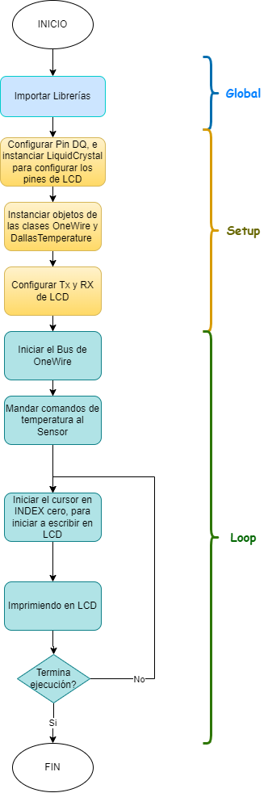

<div class="container">
<div style = "text-align: center;">
     
</div>
</div>

#Sensores Temperatura Arduino

_Este proyecto es realizado a petición de **"Comercializadora VHBA S.A de C.V."**
 el cual consta de un monitor con sensores de temperatura hechos en Arduino._

## Comenzando 🚀

_Acceder al repositorio [Sensores de temperatura](https://github.com/VaniaSantacruz/Sensor-de-Temperatura-Bluethoot-.git)
 y abrir una terminal en el aquipo para ejecutar el siguiente comando:_

```
git clone https://github.com/VaniaSantacruz/Sensor-de-Temperatura-Bluethoot-.git
```

### Pre-requisitos 📋

_Se debe tener instalado Arduino_

### Instalación 🔧

_Una serie de ejemplos paso a paso que te dice lo que debes ejecutar para tener un entorno de desarrollo ejecutandose_

_Dí cómo será ese paso_

```
Da un ejemplo
```

_Y repite_

```
hasta finalizar
```

###Diagramas de Flujo 🌳

<div style="text-align:center;">
    
    <div style="text-align:center;">
        <p style="color: #80fa5c">Fig1. Diagrama de flujo</p>
    </div>
</div>

### Diagramas de secuencia 🎛📰

<div style="text-align: center">
    
</div>

_Finaliza con un ejemplo de cómo obtener datos del sistema o como usarlos para una pequeña demo_

## Ejecutando las pruebas ⚙️

_Explica como ejecutar las pruebas automatizadas para este sistema_

### Analice las pruebas end-to-end 🔩

_Explica que verifican estas pruebas y por qué_

```
Da un ejemplo
```

### Y las pruebas de estilo de codificación ⌨️

_Explica que verifican estas pruebas y por qué_

```
Da un ejemplo
```

## Despliegue 📦

_Agrega notas adicionales sobre como hacer deploy_

## Construido con 🛠️

_Este proyecto esta construido con:_

* [Arduino](https://docs.arduino.cc/) -Tecnología principal

## Wiki 📖

Puedes encontrar mucho más de cómo utilizar este proyecto en nuestra [Wiki](https://github.com/VaniaSantacruz/Sensor-de-Temperatura-Bluethoot-/wiki)

## Versionado 📌

Usamos [SemVer](http://semver.org/) para el versionado. Para todas las versiones disponibles, mira los [tags en este repositorio](https://github.com/tu/proyecto/tags).

## Autores ✒️

* **Vania Denis Alonso Santacruz** - *Trabajo Inicial* - [@VaniaSantacruz](https://github.com/VaniaSantacruz)
* **Luis Gerardo Baeza Ramirez** - *Documentación* - [@ThunderGer](https://github.com/ThunderGer23)

## Licencia 📄

Este proyecto está bajo la Licencia Eclipse Public License - v 2.0 - mira el archivo [LICENSE](LICENSE) para detalles

## Expresiones de Gratitud 🎁

* A Gera, que fue la persona que me encamina día a día para dar más de mi y no rendirme en lo que más me cuesta, y brindarme la paciencia necesaria para conseguirlo.
* A mis padres, por siempre apoyarme incondicionalmente en cada paso que doy.
* A mi madre, que en cualquier parte que estes, quiero que sepas que todo lo que hago siempre es pensando en ti. Te amo 💓.
